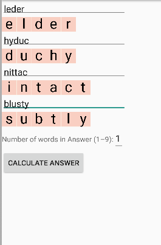
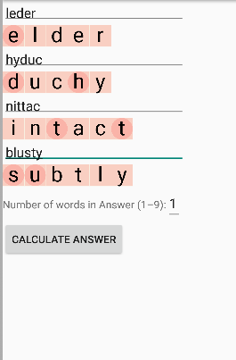
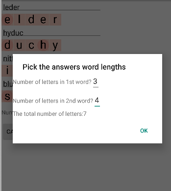
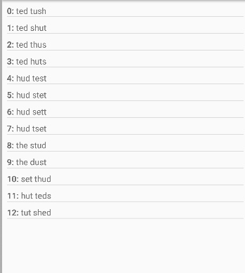

# Wordjambalaya

My first Android project. It was a learning project that simply allowed me to cheat (when needed)
on a word game named 'Jumble' that we had in our [local free newspaper](https://en.wikipedia.org/wiki/MX_(newspaper))
distributed to commuters. 

I used to get very frustrated when I occasionally found myself getting off the train without having 
solved the Jumble. So I wrote a program to help me solve those persnickety puzzles. 

Then I realised that it would be better if I made the program run on my portable Android based 
computer. Hence this program. 

**Note:** this is intended for my use only - it's not a polished for sale application.

[Jumble](https://en.wikipedia.org/wiki/Jumble) works as follows: 
A set of four jumbled words is shown. eg:

    leder
    hyduc
    nittac
    blusty

You are supposed to work out what each word could possibly be, then place the letters of the solved
word into boxes. Some of the boxes have circles around them...
So the above gives:

    Ⓔlder
    ⒹucⒽy
    inⓉacⓉ
    ⓈⓊbtly

You then select the circled letters and use them to create a set of words that solves a visual
puzzle/riddle.

In this case, "When it was his turn to clean, the room-mate left the house in... [two words, (3, 4)]

The desired answer for this particular puzzle is: "the dust"

To use the application, you simply enter the muddled words:

The unmuddled solution word are shown as you 'type'. Then you indicate the circled words by 
touching them:

Finally, tell the application how many words there are in the answer - and how long 
they each are.

The application thinks for a while, and then shows you a list of the possible answers:

Then choose the answer that best fits the solution (here, 9: "the dust").

## Possible future enhancements (if the MX ever comes back):
- The program doesn't rotate: I need to examine what happens in rotation.
- I bet that most official Jumble puzzles will not have jumbled words with more than one possible
  solution. 
- The puzzle/riddle solution just gives every possible combination of words. Some kind of smarts
  could be added to promote the most 'punny' solutions to the top of the list.
- This program could be extended to help generate Jumble puzzles.
- A restart button so that when you've solved a puzzle you can simply rerun the application without
  having to stop and start it.

## Note:
Contains the Ispell (ver 3.1.20) word list. See app/src/main/res/raw/read_me for conditions.
